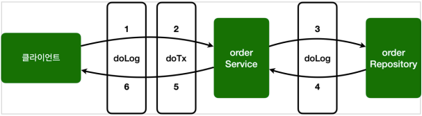
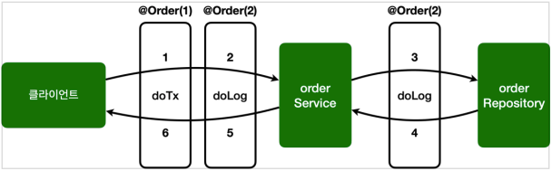

# 스프링 AOP 구현

## 예제 프로젝트 만들기

### 예제

#### OrderRepository

```java
@Slf4j
@Repository
public class OrderRepository {

    public String save(String itemId) {
        log.info("[OrderRepository] 실행");

        if (itemId.equals("ex")) {
            throw new IllegalStateException("예외 발생!");
        }

        return itemId;
    }
}

```

#### OrderService

```java
@Slf4j
@Service
@RequiredArgsConstructor
public class OrderService {

    private final OrderRepository orderRepository;

    public void orderItem(String itemId) {
        log.info("[OrderService] 실행");
        orderRepository.save(itemId);
    }
}
```

#### AopTest

```java
@Slf4j
@SpringBootTest
public class AopTest {
    @Autowired
    OrderService orderService;

    @Autowired
    OrderRepository orderRepository;

    @Test
    void aopInfo() {
        log.info("isAopProxy, orderService = {}", AopUtils.isAopProxy(orderService));
        log.info("isAopProxy, orderRepository = {}", AopUtils.isAopProxy(orderRepository));
    }

    @Test
    void success() {
        orderService.orderItem("itemA");
    }

    @Test
    void exception() {
        Assertions.assertThatThrownBy(
                () -> orderService.orderItem("ex")
        ).isInstanceOf(IllegalStateException.class);
    }
}
```

### 실행 로그

#### aopInfo

```
isAopProxy, orderService = false
isAopProxy, orderRepository = false
```

#### success

```java
[OrderService] 실행
[OrderRepository] 실행
```

## 스프링 AOP 구현 1 - 시작

### 예제

#### AspectV1

```java
@Slf4j
@Aspect
public class AspectV1 {

    @Around("execution(* hello.aop.order..*(..))")
    public Object doLog(
            ProceedingJoinPoint joinPoint
    ) throws Throwable {
        log.info("[log] {}", joinPoint.getSignature());
        return joinPoint.proceed();
    }
}
```

* `@Around` 애노테이션의 값인 `execution(* hello.aop.order..*(..))` 는 포인트컷이 된다.
* `@Around` 애노테이션의 메서드인 `doLog` 는 어드바이스(`Advice`)가 된다.
* `execution(* hello.aop.order..*(..))`
    * `hello.aop.order` 패키지와 그 하위 패키지(`..`)를 지정하는 `AspectJ` 포인트컷 표현식이다.
    * 앞으로는 간단히 포인트컷 표현식이라 하겠다.
    * 참고로 표인트컷 표현식은 뒤에서 자세히 설명하겠다.
* 이제 `OrderService`, `OrderRepository`의 모든 메서드는 AOP 적용의 대상이 된다.
    * 참고로 스프링은 프록시 방식의 AOP를 사용하므로 프록시를 통하는 메서드만 적용 대상이 된다.

> **참고**
>
> 스프링 AOP는 AspectJ의 문법을 차용하고, 프록시 방식의 AOP를 제공한다.
> AspectJ를 직접 사용하는 것이 아니다.
>
> 스프링 AOP를 사용할 때는 `@Aspect` 애노테이션을 주로 사용하는데,
> 이 애노테이션도 AspectJ가 제공하는 애노테이션이다.

> **참고**
>
> `@Aspect`를 포함한 `org.aspectj` 패키지 관련 기능은 `aspectjweaver.jar` 라이브러리가 제공하는 기능이다.
>
> 앞서 `build.gradle`에 `spring-boot-starter-aop`를 포함했는데,
> 이렇게 하면 스프링의 AOP 관련 기능과 함께 `aspectjweaver.jar`도 함께 사용할 수 있게 의존 관계에 포함된다.
>
> 그런데 스프링에서는 AspectJ가 제공하는 애노테이션이나 관련 인터페이스만 사용하는 것이고,
> 실제 AspectJ가 제공하는 컴파일, 로드타임 위버 등을 사용하는 것은 아니다.
> 스프링은 지금까지 우리가 학습한 것 처럼 프록시 방식의 AOP를 사용한다.

#### AopTest

```java
@Slf4j
@Import({AspectV1.class}) // 추가
@SpringBootTest
public class AopTest { ... }
```

`@Aspect`는 애스펙트라는 표식이지 컴포넌트 스캔이 되는 것은 아니다.
따라서 `AspectV1`를 AOP로 사용하려면 스프링 빈으로 등록해야 한다.

스프링 빈으로 등록하는 방법은 다음과 같다.

* `@Bean`을 사용해서 직접 등록
* `@Component` 컴포넌트 스캔을 사용해서 자동 등록
* `@Import` 주로 설정 파일을 추가할 때 사용(`@Configuration`)

### 실행 로그

#### aopInfo

```
isAopProxy, orderService = true
isAopProxy, orderRepository = true
```

#### success

```
[log] void hello.aop.order.OrderService.orderItem(String)
[OrderService] 실행
[log] String hello.aop.order.OrderRepository.save(String)
[OrderRepository] 실행
```

## 스프링 AOP 구현 2 - 포인트컷 분리

### 포인트컷 분리

#### AspectV2

```java
@Slf4j
@Aspect
public class AspectV2 {

    /**
     * 포인트컷 분리
     * - 포인트컷 시그니처: 메서드 이름 + 파라미터
     * - 반환 타입: void
     * - 코드 내용은 비워둔다.
     * - 하나의 포인트컷 표현식을 여러 어드바이스에서 함께 사용할 수 있다.
     * - public으로 선언하면 다른 클래스의 외부 어드바이스에서도 함께 사용할 수 있다.
     *
     * @see Pointcut
     */
    @Pointcut("execution(* hello.aop.order..*(..))")
    private void allOrder() {
    }

    /**
     * 분리한 포인트컷을 아래와 같이 사용
     */
    @Around("allOrder()")
    public Object doLog(
            ProceedingJoinPoint joinPoint
    ) throws Throwable {
        log.info("[log] {}", joinPoint.getSignature());
        return joinPoint.proceed();
    }
}
```

#### @Pointcut

* 포인트컷 시그니처: 메서드 이름 + 파라미터
* 반환 타입: `void`
* 코드 내용은 비워둔다.
* 하나의 포인트컷 표현식을 여러 어드바이스에서 함께 사용할 수 있다.
* `public`으로 선언하면 다른 클래스의 외부 어드바이스에서도 함께 사용할 수 있다.

## 스프링 AOP 구현 3 - 어드바이스 추가

### 어드바이스 추가

앞서 로그를 출력하는 기능에 추가로 트랜잭션을 적용하는 코드도 추가해보자.
여기서는 진짜 트랜잭션을 실행하는 것은 아니다. 기능이 동작한 것 처럼 로그만 남기겠다.

#### 트랜잭션 기능은 보통 다음과 같이 동작한다.

* 핵심 로직 실행 직전에 트랜잭션을 시작
* 핵심 로직 실행
* 핵심 로직 실행에 문제가 없으면 커밋
* 핵심 로직 실행에 예외가 발생하면 롤백

### 예제

#### AspectV3

```java
@Slf4j
@Aspect
public class AspectV3 {

    /**
     * hello.aop.order 패키지와 하위 패키지
     */
    @Pointcut("execution(* hello.aop.order..*(..))")
    private void allOrder() {
    }

    /**
     * 타입 이름 패턴이 *Service
     */
    @Pointcut("execution(* *..*Service.*(..))")
    private void allService() {
    }

    /**
     * hello.aop.order 패키지와 하위 패키지
     */
    @Around("allOrder()")
    public Object doLog(
            ProceedingJoinPoint joinPoint
    ) throws Throwable { ... }

    /**
     * hello.aop.order 패키지와 하위 패키지 +
     * 타입 이름 패턴이 *Service
     */
    @Around("allOrder() && allService()")
    public Object doTransaction(
            ProceedingJoinPoint joinPoint
    ) throws Throwable {
        Signature signature = joinPoint.getSignature();

        try {
            log.info("[트랜잭션 시작] {}", signature);

            Object result = joinPoint.proceed();

            log.info("[트랜잭션 커밋] {}", signature);
            return result;
        } catch (Exception e) {
            log.info("[트랜잭션 롤백] {}", signature);
            throw e;
        } finally {
            log.info("[Resource Release] {}", signature);
        }
    }
}
```

#### AopTest

```java
@Slf4j
@Import({AspectV3.class}) // 교체
@SpringBootTest
public class AopTest { ... }
```

#### AOP 적용 결과

* `orderService`
    * `doLog()`, `doTransaction()` 어드바이스 적용
* `orderRepository`
    * `doLog()` 어드바이스 적용

### 실행 로그



#### success

```
# Client -> doLog -> doTransaction -> OrderService
[log] void hello.aop.order.OrderService.orderItem(String)
[트랜잭션 시작] void hello.aop.order.OrderService.orderItem(String)
[OrderService] 실행

# -> doLog -> OrderRepository
[log] String hello.aop.order.OrderRepository.save(String)
[OrderRepository] 실행

# OrderRepository -> doLog 
# -> OrderService -> doTrasaction -> doLog -> Client
[트랜잭션 커밋] void hello.aop.order.OrderService.orderItem(String)
[Resource Release] void hello.aop.order.OrderService.orderItem(String)
```

#### exception

```
# Client -> doLog -> doTransaction -> OrderService
[log] void hello.aop.order.OrderService.orderItem(String)
[트랜잭션 시작] void hello.aop.order.OrderService.orderItem(String)

# -> doLog -> OrderRepository
[OrderService] 실행
[log] String hello.aop.order.OrderRepository.save(String)
[OrderRepository] 실행

# OrderRepository -> doLog 
# -> OrderService -> doTrasaction -> doLog -> Client
[트랜잭션 롤백] void hello.aop.order.OrderService.orderItem(String)
[Resource Release] void hello.aop.order.OrderService.orderItem(String)
```

## 스프링 AOP 구현 4 - 포인트컷 참조

### 포인트컷 파일 분리

* 포인트컷을 공용으로 사용하기 위해 별도의 외부 클래스에 모아두어도 된다.
* 참고로 외부에서 호출할 때는 포인트컷의 접근 제어자를 `public`으로 열어두어야 한다.

### 예제

#### Pointcuts

```java
/**
 * 포인트컷을 외부에 뺄 수 있다.
 */
public class Pointcuts {

    /**
     * hello.aop.order 패키지와 하위 패키지
     */
    @Pointcut("execution(* hello.aop.order..*(..))")
    public void allOrder() {
    }

    /**
     * 타입 패턴이 *Service
     */
    @Pointcut("execution(* *..*Service.*(..))")
    public void allService() {
    }

    /**
     * allOrder && allService
     */
    @Pointcut("allOrder() && allService()")
    public void orderAndService() {
    }
}
```

#### AspectV4

```java
@Slf4j
@Aspect
public class AspectV4 {

    /**
     * 외부 클래스의 포인트컷을 가져오려면 풀 패키지로 작성해야한다.
     */
    @Around("hello.aop.order.aop.Pointcuts.allOrder()")
    public Object doLog(
            ProceedingJoinPoint joinPoint
    ) throws Throwable { ... }

    @Around("hello.aop.order.aop.Pointcuts.orderAndService()")
    public Object doTransaction(
            ProceedingJoinPoint joinPoint
    ) throws Throwable { ... }
}
```

## 스프링 AOP 구현 5 - 어드바이스 순서

### 어드바이스 순서

어드바이스는 기본적으로 **순서를 보장하지 않는다.**
순서를 지정하고 싶으면 `@Aspect` 적용 단위로 `org.springframework.core.annotation.@Order` 애노테이션을 적용해야 한다.

문제는 이것을 어드바이스 단위가 아니라 **클래스 단위로 적용할 수 있다는 점**이다.
그래서 지금처럼 하나의 애스펙트에 여러 어드바이스가 있으면 순서를 보장 받을 수 없다.
따라서 애스펙트를 **별도의 클래스로 분리**해야 한다.

### 예제

#### AspectV5

```java
/**
 * Order는 메서드 단위가 아닌 클래스 단위에서만 적용된다.
 * 때문에, 아래와 같이 각각 클래스를 새로 만들어 어드바이저로 만들어주어야 한다.
 */
@Slf4j
public class AspectV5 {

    // 2 순위
    @Aspect
    @Order(2)
    public static class LogAspect {
        @Around("hello.aop.order.aop.Pointcuts.allOrder()")
        public Object doLog(
                ProceedingJoinPoint joinPoint
        ) throws Throwable { ... }
    }

    // 1 순위
    @Aspect
    @Order(1)
    public static class TxAspect {
        @Around("hello.aop.order.aop.Pointcuts.orderAndService()")
        public Object doTransaction(
                ProceedingJoinPoint joinPoint
        ) throws Throwable { ... }
    }
}
```

#### AopTest

```java
@Slf4j
@Import({AspectV5.LogAspect.class, AspectV5.TxAspect.class})
@SpringBootTest
public class AopTest { ... }
```

### 실행 로그



#### success

```
# Client -> doTransaction -> doLog -> OrderService
[트랜잭션 시작] void hello.aop.order.OrderService.orderItem(String)
[log] void hello.aop.order.OrderService.orderItem(String)
[OrderService] 실행

# -> doLog -> OrderRepository
[log] String hello.aop.order.OrderRepository.save(String)
[OrderRepository] 실행

# OrderRepository -> doLog 
# -> OrderService -> doLog -> doTransaction -> Client
[트랜잭션 커밋] void hello.aop.order.OrderService.orderItem(String)
[Resource Release] void hello.aop.order.OrderService.orderItem(String)
```

#### exception

```
# Client -> doTransaction -> doLog -> OrderService
[트랜잭션 시작] void hello.aop.order.OrderService.orderItem(String)
[log] void hello.aop.order.OrderService.orderItem(String)
[OrderService] 실행

# -> doLog -> OrderRepository
[log] String hello.aop.order.OrderRepository.save(String)
[OrderRepository] 실행

# OrderRepository -> doLog 
# -> OrderService -> doLog -> doTransaction -> Client
[트랜잭션 롤백] void hello.aop.order.OrderService.orderItem(String)
[Resource Release] void hello.aop.order.OrderService.orderItem(String)
```

## 스프링 AOP 구현 6 - 어드바이스 종류